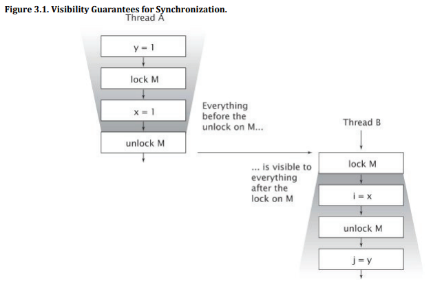

# Java Concurrency

The education project.

## Books

### [Java Concurrency in Practice](https://www.amazon.com/gp/product/0321349601)

#### Quotes

The same mutable state:

> If multiple threads access the same mutable state variable without appropriate synchronization, 
> your program is broken. There are three ways to fix it:
> - Don't share the state variable across threads;
> - Make the state variable immutable; or
> - Use synchronization whenever accessing the state variable

Best friends:

> When designing thread-safe classes, good object-oriented techniques - encapsulation, immutability, 
> and clear specification of invariants - are your best friends.

Thread-safe class:

> A class is thread-safe if it behaves correctly when accessed from multiple threads, regardless of 
> the scheduling or interleaving of the execution of those threads by the runtime environment, 
> and with no additional synchronization or other coordination on the part of the calling code.

> Thread-safe classes encapsulate any needed synchronization so that clients need not provide their own.

> Stateless objects are always thread-safe.

Atomicity:

> Operations A and B are atomic with respect to each other if, from the perspective of a thread executing A,
> when another thread executes B, either all of B has executed or none of it has.
> An atomic operation is one that is atomic with respect to all operations, including itself,
> that operate on the same state.

> Where practical, use existing thread-safe objects, like AtomicLong, to manage your class's state.
> It is simpler to reason about the possible states and state transitions for existing thread-safe objects
> than it is for arbitrary state variables, and this makes it easier to maintain and verify thread safety.

> To preserve state consistency, update related state variables in a single atomic operation.

Intrinsic Locks:

> ```java
> synchronized (lock) {
>     // Access or modify shared state guarded by lock
> }
> ```

Guarding State with Locks:

> For each mutable state variable that may be accessed by more than one thread,
> all accesses to that variable must be performed with the same lock held.
> In this case, we say that the variable is guarded by that lock.

> Every shared, mutable variable should be guarded by exactly one lock.
> Make it clear to maintainers which lock that is.

> For every invariant that involves more than one variable,
> all the variables involved in that invariant must be guarded by the same lock.

Simplicity and performance:

> There is frequently a tension between simplicity and performance.
> When implementing a synchronization policy, resist the temptation
> to prematurely sacrifice simplicity (potentially compromising safety) for the sake of performance.

> Avoid holding locks during lengthy computations or operations at risk
> of not completing quickly such as network or console I/O.

Visibility:

> In the absence of synchronization, the compiler, processor,
> and runtime can do some downright weird things to the order in which operations appear to execute.
> Attempts to reason about the order in which memory actions "must" happen in
> insufficiently synchronized multithreaded programs will almost certainly be incorrect.

Locking and Visibility:

> Locking is not just about mutual exclusion; it is also about memory visibility.
> To ensure that all threads see the most up-to-date values of shared mutable variables,
> the reading and writing threads must synchronize on a common lock.
>
> 

Volatile Variables:

> Use volatile variables only when they simplify implementing and verifying your synchronization policy; avoid using
> volatile variables when verifying correctness would require subtle reasoning about visibility. Good uses of volatile
> variables include ensuring the visibility of their own state, that of the object they refer to, or indicating that an
> important lifecycle event (such as initialization or shutdown) has occurred.

Visibility and atomicity:

> Locking can guarantee both visibility and atomicity; volatile variables can only guarantee visibility.

Safe Construction:

> Do not allow the this reference to escape during construction.

Immutability:

> Immutable objects are always thread-safe.

> An object is immutable if:
> - Its state cannot be modified after construction;
> - All its fields are final; and
> - It is properly constructed (the this reference does not escape during construction).

Final Fields:

> Just as it is a good practice to make all fields private unless they need greater visibility,
> it is a good practice to make all fields final unless they need to be mutable.

Immutable objects:

> Immutable objects can be used safely by any thread without additional synchronization,
> even when synchronization is not used to publish them.

Safe Publication Idioms:

> To publish an object safely, both the reference to the object and the object's state must be made visible to other
> threads at the same time. A properly constructed object can be safely published by:
> - Initializing an object reference from a static initializer;
> - Storing a reference to it into a volatile field or AtomicReference;
> - Storing a reference to it into a final field of a properly constructed object; or
> - Storing a reference to it into a field that is properly guarded by a lock.

> Using a static initializer is often the easiest and safest way to publish objects that can be statically constructed:
> ```java
> public static Holder holder = new Holder(42);
> ```

Effectively Immutable Objects:

> Safely published effectively immutable objects can be used safely by any thread without additional synchronization

Mutable Objects:

> The publication requirements for an object depend on its mutability:
> - Immutable objects can be published through any mechanism;
> - Effectively immutable objects must be safely published;
> - Mutable objects must be safely published, and must be either thread-safe or guarded by a lock.

Sharing Objects Safely:

> The mostThe most useful policies for using and sharing objects in a concurrent program are:
> - Thread-confined. A thread-confined object is owned exclusively by and confined to one thread,
> and can be modified by its owning thread.
> - Shared read-only. A shared read-only object can be accessed concurrently by multiple threads
> without additional synchronization, but cannot be modified by any thread. 
> Shared read-only objects include immutable and effectively immutable objects.
> - Shared thread-safe. A thread-safe object performs synchronization internally,
> so multiple threads can freely access it through its public interface without further synchronization.
> - Guarded. A guarded object can be accessed only with a specific lock held. Guarded objects include those that are
> encapsulated within other thread-safe objects and published objects that are known to be guarded by a specific lock.

Designing a Thread-safe Class:

> The design process for a thread-safe class should include these three basic elements:
> - Identify the variables that form the object's state;
> - Identify the invariants that constrain the state variables;
> - Establish a policy for managing concurrent access to the object's state.

Gathering Synchronization Requirements:

> You cannot ensure thread safety without understanding an object's invariants and post-conditions.
> Constraints on the valid values or state transitions for state variables can create
> atomicity and encapsulation requirements.

Instance Confinement:

> Encapsulating data within an object confines access to the data to the object's methods,
> making it easier to ensure that the data is always accessed with the appropriate lock held.

> Confinement makes it easier to build thread-safe classes because a class that
> confines its state can be analyzed for thread safety without having to examine the whole program.

When Delegation Fails:

> If a class is composed of multiple independent thread-safe state variables and has no operations
> that have any invalid state transitions, then it can delegate thread safety to the underlying state variables.

Publishing Underlying State Variables:

> If a state variable is thread-safe, does not participate in any invariants that constrain its value,
> and has no prohibited state transitions for any of its operations, then it can safely be published.

Documenting Synchronization Policies:

> Document a class's thread safety guarantees for its clients; 
> document its synchronization policy for its maintainers.

Hidden Iterators:

> Just as encapsulating an object's state makes it easier to preserve its invariants, 
> encapsulating its synchronization makes it easier to enforce its synchronization policy.

Concurrent Collections:

> Replacing synchronized collections with concurrent collections can offer dramatic scalability improvements
> with little risk.

Queues:

> Bounded queues are a powerful resource management tool for building reliable applications:
> they make your program more robust to overload by throttling activities
> that threaten to produce more work than can be handled.

Summary of Part I:

> - It's the mutable state, stupid.
> All concurrency issues boil down to coordinating access to mutable state.
> The less mutable state, the easier it is to ensure thread safety.
> - Make fields final unless they need to be mutable.
> - Immutable objects are automatically thread-safe.
> Immutable objects simplify concurrent programming tremendously.
> They are simpler and safer, and can be shared freely without locking or defensive copying.
> - Encapsulation makes it practical to manage the complexity.
> You could write a thread-safe program with all data stored in global variables, but why would you want to?
> Encapsulating data within objects makes it easier to preserve their invariants;
> encapsulating synchronization within objects makes it easier to comply with their synchronization policy.
> - Guard each mutable variable with a lock.
> - Guard all variables in an invariant with the same lock.
> - Hold locks for the duration of compound actions.
> - A program that accesses a mutable variable from multiple threads without synchronization is a broken program.
> - Don't rely on clever reasoning about why you don't need to synchronize.
> - Include thread safety in the design processor explicitly document that your class is not thread-safe.
> - Document your synchronization policy.

Finding Exploitable Parallelism:

> The real performance payoff of dividing a program's workload into tasks comes when there are a large number of
> independent, homogeneous tasks that can be processed concurrently.

## Status

In progress.
